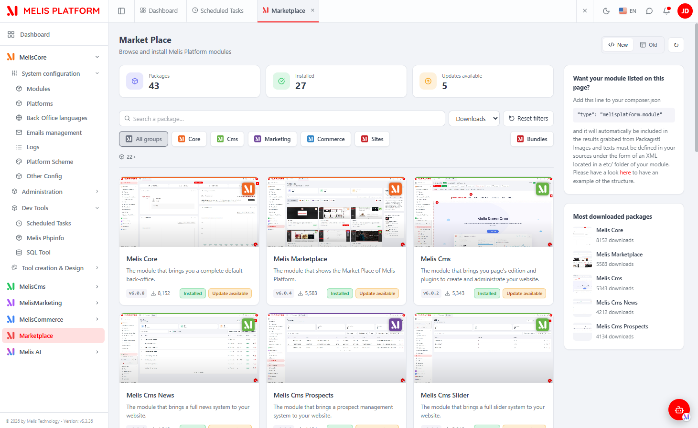
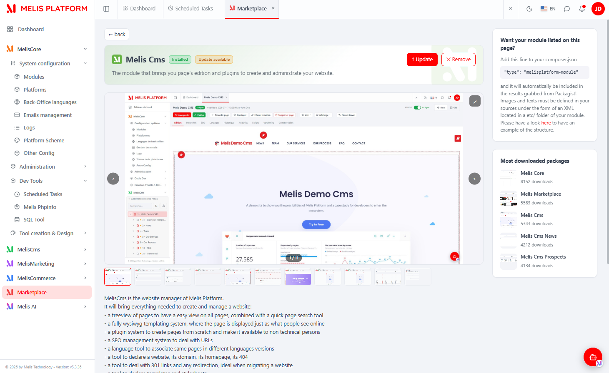

# MelisMarketPlace (React back-office) — Functional & Technical Documentation (for AI)

> **What this is.** MelisMarketPlace is the back-office **module store**: it lists every Melis
> Platform module published on the **Melis Packagist** server, shows whether each installed module
> is up to date, and lets you **download, update or remove** modules without leaving the back-office.
> This document covers it **in the new React back-office** (`/melis-react`): the module ships a
> **native full-React brick** — a real React catalogue (list + product detail) reading a `react-api`
> JSON layer it **owns itself**, with a **New / Old toggle** that can fall back to the legacy tool in
> an iframe. The install / update / remove flow is driven **natively** by calling the module's
> **legacy** PHP endpoints (Composer / dbdeploy stay server-side). For the underlying deploy
> machinery, services and the Packagist contract, see the [legacy tool doc](./MelisMarketPlace.md);
> this doc does not repeat them.
>
> **How this document is organised — two clearly separated parts:**
> - **[Part A — Functional Guide](#part-a--functional-guide)** — for everyday users (and the
>   chat assistant) using the React back-office. Plain language.
> - **[Part B — Technical Reference](#part-b--technical-reference)** — for developers and AI
>   building inside the React UI, with code (brick manifest, endpoints, capabilities).
>
> **Audience**: consumed by the **MelisAI** MCP. **Status**: reviewed 2026-08-19.

---

## 0. Where this lives in the React back-office — read this first

- **Brick kind: native full-React** (not an iframe brick). Both the **catalogue list** and each
  **product detail** are authored in React (`ui-react/src/`) and read through
  `/melis/MelisMarketPlace/react-api/…` endpoints **owned by the module** (not the shared
  `melis-react-api`). The tool keeps a **New / Old toggle** on the list: *Old* renders the legacy
  tool in an iframe (`/melis/react-tool-page?key=melis_market_place_tool_display`), *New* is the
  React UI (default).
- **The mutating actions (Download / Update / Remove) are native too**, but they do **not** have
  their own react-api endpoints: React replays the legacy JS orchestration by calling the module's
  **legacy** controller actions (`/melis/MelisMarketPlace/MelisMarketPlace/…`) directly — Composer,
  dbdeploy and filesystem work stay server-side, unchanged (see §B3).
- **Where in the menu.** Sidebar → the **Market Place** entry (shopping-cart icon). The manifest
  `route` is `/melis-marketplace`; `forwardKey` `MelisMarketPlace/MelisMarketPlace` maps the legacy
  menu node to it. The Market Place menu section is a **directly-clickable / `is_parent_tool`**
  node, so — unusually — the **rights-bearing key and the manifest zone key are the same**
  (`melis_market_place_tool_display`); see §B4.
- **No sub-tabs.** The manifest has **no `subTabs`** — list ⇄ detail is pure internal state (one
  brick = one host tab); opening a package never spawns a shell tab (a Marketplace-specific fix,
  see §B2).
- **Coupled foundation.** MarketPlace drives MelisComposerDeploy / MelisDbDeploy / MelisAssetManager
  under the hood; those live in the legacy doc. Cross-reference:
  [MelisMarketPlace.md](./MelisMarketPlace.md).

---
---

# PART A — Functional Guide

## A1. What you can do with MelisMarketPlace in the new back-office

- **Browse the catalogue** — a searchable grid of module cards (title, cover image, version,
  download count, group), with **KPI cards** (Packages / Installed / Updates available), a **group
  filter** (Core / Cms / Marketing / Commerce / Sites), a **Bundles** filter, sorting
  (Downloads / Date added / Name) and **infinite scroll**.
- **Open a module** — a full **product view** with an image gallery (slider + lightbox), description,
  additional information (latest/current version, GitHub, Packagist, package name, downloads) and the
  action buttons.
- **Download** a module you don't have yet, **Update** one that's behind, or **Remove** one you no
  longer need — each runs a native progress console (with a dependency-safety check before removing).
- **See what needs updating** — the **Updates available** KPI and per-card / per-detail **Update
  available** badges.
- **Compare New vs Old** — switch the whole tool between the React UI and the classic tool with the
  **New / Old** toggle.

## A2. Finding it in /melis-react

**Where:** left sidebar → **Market Place** (shopping-cart icon). It opens as a top tab named
**Market Place**.


*The React Market Place list: title + subtitle, KPI cards (Packages / Installed / Updates available), a search box, a sort selector, "Reset filters", the group filter buttons (All groups · Core · Cms · Marketing · Commerce · Sites) and a Bundles button, the New/Old toggle and a refresh (↻) button top-right, then the grid of module cards (cover image, group "M" logo, title, description, version chip, download count, Installed / Update badges or a Download button). A right sidebar holds "Want your module listed on this page?" and "Most downloaded packages".*

## A3. Key words explained

- **Package / module** — one Melis Platform module (a `melisplatform-module` Composer package),
  shown as a card. A **site product** is a special package that scaffolds a whole website.
- **Group** — the module's category (Core, Cms, Marketing, Commerce, Sites), each with its coloured
  "M" logo; used as a quick filter.
- **Installed / Update available** — badges computed by comparing your **installed** version against
  the **latest published** one (see the legacy doc's status table).
- **Protected (exempted) module** — a foundation module (MelisCore, MelisEngine, MelisFront,
  MelisAssetManager, MelisComposerDeploy, MelisDbDeploy) that can never be removed or updated from
  the store.
- **New / Old** — the two views of the same tool: **New** = React UI, **Old** = the classic tool in
  an iframe.

> For the domain glossary, status logic and the deploy machinery, see the
> [legacy doc](./MelisMarketPlace.md).

## A4. The catalogue (list)

The list shows **every package on the Packagist server**. It has **KPI cards** (Packages, Installed,
Updates available), a **search** box, a **sort** selector (Downloads / Date added / Name), a **Reset
filters** button, the **group filter** buttons and a **Bundles** toggle. The grid loads more as you
scroll (**infinite scroll**); a **refresh (↻)** button re-reads status after an action. Each card is
clickable and opens the product view.

> **Tip:** the **New / Old** toggle (top-right) switches the list between the React UI and the legacy
> tool in an iframe; use it to compare the two interfaces. On narrow viewports the toggle becomes
> icon-only.

> **If the store is empty or greyed out:** the React UI shows a message when the **Melis Packagist**
> server is unreachable (`marketAccessible = false`) — browsing is disabled but the shell stays up.

## A5. A module's product view (detail)

Clicking a card opens the **product view** (still native React, no page reload): a hero banner (group
logo + title + status badges + action buttons), an **image gallery** (slider with a full-screen
lightbox), the description, and an **Additional information** panel (latest version, current version
if installed, GitHub, Packagist, package name, downloads). A **← back** button returns to the list
(which stays mounted, so your search / filters / scroll are preserved).


*The React product view for "Melis Cms": a ← back button, the title with an "Update available" badge, the Update and Remove action buttons, an image gallery of platform screenshots (with slider arrows and thumbnails), a description, and the "Want your module listed?" / "Most downloaded packages" sidebar.*

The action buttons depend on state and on your **capabilities** (§B4):

- **Download** — for a module you don't have (Composer fetches it; then dbdeploy + activate).
- **Update** — for an installed module that is behind (`need_update`).
- **Remove** — for an installed, non-protected module (blocked if other modules depend on it).
- **Private** — a locked badge for a private module (must be bought; a contact panel is shown).

Each action opens a **Manage** modal with a live **progress console** that streams the Composer /
dbdeploy output, then offers **Activate module** / **Reload**.

## A6. Common tasks — "How do I…?"

- **Find a module** → Market Place → type in the search box, or pick a **group** / **Bundles**.
- **Install a module** → open the card → **Download** → confirm → wait for the console → **Activate
  module**.
- **Update a module that's behind** → the **Updates available** KPI tells you how many; open the
  module → **Update**.
- **Remove a module** → open it → **Remove** (a dependency check runs first; protected modules have
  no Remove button).
- **Compare with the classic tool** → list → top-right **New / Old** toggle → **Old**.
- **Refresh status after an action** → the **↻** button on the list.

---
---

# PART B — Technical Reference

## B1. React presence at a glance

| Item | Value |
|---|---|
| Brick kind | **Native full-React** (list + detail; native manage flow over legacy endpoints; New/Old legacy-iframe fallback on the list) |
| Brick id | `marketplace` (matches `brick.tsx` ⇄ `brick.manifest.json`) |
| Manifest `route` | `/melis-marketplace` |
| `label` | `Market Place` |
| `forwardKey` | `MelisMarketPlace/MelisMarketPlace` |
| `melisKey` (manifest / Old-view iframe) | `melis_market_place_tool_display` |
| `entry` | `brick.js` |
| `subTabs` | *absent* (no host sub-tabs; list ⇄ detail is internal state) |
| `persistent` | `true` (brick kept mounted) |
| Access-guard **and** capabilities melisKey | `melis_market_place_tool_display` (same node — the section is `is_parent_tool`/directly clickable) |
| React API base | `/melis/MelisMarketPlace/react-api` (module-owned, **not** `melis-react-api`) |
| Legacy manage endpoints | `/melis/MelisMarketPlace/MelisMarketPlace/…` (Composer/dbdeploy, unchanged) |
| Activation-gated | Yes (appears iff the module is in `config/melis.module.load.php`) |

## B2. The brick — anatomy

Source in `ui-react/` (Vite **IIFE**, React / ReactDOM / react-router-dom externalised to the host
globals `MelisReact*`, output to `public/ui-react/brick.js` next to `brick.manifest.json`). The brick
uses **inline styles + theme CSS variables** and an **in-file i18n** dictionary (it cannot import
host modules).

`ui-react/src/brick.tsx` registers ONE routed component under the brick id:
```tsx
import MarketPlacePage from './MarketPlacePage'
window.__melisRegisterBrick?.({ id: 'marketplace', Component: MarketPlacePage })  // id MUST match the manifest
```

Manifest (`public/ui-react/brick.manifest.json`):
```json
{ "id": "marketplace", "route": "/melis-marketplace", "label": "Market Place",
  "forwardKey": "MelisMarketPlace/MelisMarketPlace", "melisKey": "melis_market_place_tool_display",
  "entry": "brick.js", "persistent": true }
```

React components (`ui-react/src/`):

| File | Role |
|---|---|
| `brick.tsx` | Brick entry point — registers `id: 'marketplace'` with `MarketPlacePage`. |
| `MarketPlacePage.tsx` | The whole tool. `MarketPlacePage` holds `openId` state: it shows `PackageList` (kept mounted, hidden when a detail is open) and, when a package is opened, `PackageDetail` on top. **No react-router navigation and no extra host tabs** — one brick = one host tab; spawning tabs under this route made Shell's tab-close cleanup unmount the whole brick. It bundles: `PackageList` (KPI, search, group/bundle filters, sort, infinite scroll, the **New/Old** `mode` toggle + the **Old-view iframe** `/melis/react-tool-page?key=melis_market_place_tool_display`), `PackageCard`, `Sidebar` ("module listing" + "most downloaded"), `PackageDetail` (hero, `ImageGallery` slider+lightbox, additional-info), and `ManageModal` (the native download/update/remove console). |
| `ViewToggle.tsx` | The reusable **New (React) / Old (iframe)** toggle (`type ViewMode = 'react' \| 'iframe'`), `compact` icon-only mode for narrow viewports. |
| `marketplace-api.ts` | The read-only API client (see §B3) — `fetchPackages`, `fetchPackageById`, `fetchPackageGroups`, `fetchMarketPlaceStats`; the `{ success, data, error }` contract and the `PackageItem` / `PackageDetail` / `MarketPlaceStats` shapes. |
| `shared/useCaps.ts` | Bridge to the host capability resolver (`window.__melisUseCaps(melisKey)`) — gates the list body and the action buttons. |
| `shared/useDebounce.ts` | Debounces the search input (300 ms). |
| `shared/useIsNarrow.ts` | Responsive helper (narrow viewport → stacked layout, compact toggle). |

> **Brick constraint:** the bundle externalises only React/ReactDOM/react-router-dom to the host
> globals; it cannot import host modules (Tailwind/shadcn/lucide/i18n) — hence inline styles, in-file
> SVG icons and an in-file `{fr,en}` dictionary driven by the host language.

> **Image fallback:** cards/gallery request the **React** screenshots (branch `melis-react`,
> `react/` subfolder) in `src` with the **legacy** URL in `data-legacy`; `mpImgFallback` swaps to the
> legacy image `onError`. (Screenshots can be absent in production when the installed version tag has
> no `melis-react` branch — the legacy image then serves; that is the image-URL-vs-version-tag
> behaviour, not a tool bug.)

## B3. React API — endpoints

The catalogue's **read-only** routes are declared **in `config/module.config.php`** — but, unlike
MelisCmsNews, they are **module-owned** (nested under the `application-MelisMarketPlace` route, base
`/melis/MelisMarketPlace/react-api`), **not** under the shared `melis-react-api` node. Controller:
**`MelisMarketPlace\Controller\MelisMarketPlaceReactApiController`** (invokable alias
`MelisMarketPlace\Controller\MelisMarketPlaceReactApi`). Contract `{ success, data, error }`; every
fetch sends `X-Requested-With: XMLHttpRequest` + `credentials:'include'`.

| Method & URL | Action | Purpose |
|---|---|---|
| `GET /melis/MelisMarketPlace/react-api/packages` | `packages` | List packages (`page`, `limit`, `search`, `group`, `orderBy`, `order`, `bundle`) → `{items, page, pageCount, limit, marketAccessible}` |
| `GET /melis/MelisMarketPlace/react-api/packages/:id` | `get` | One package detail (`images`, `currentVersion`, `isExempted`, versionStatus…) |
| `GET /melis/MelisMarketPlace/react-api/groups` | `groups` | Package groups → `{groups, marketAccessible}` |
| `GET /melis/MelisMarketPlace/react-api/stats` | `stats` | KPI `{total, installed, needUpdate, marketAccessible}` |
| `GET /melis/MelisMarketPlace/react-api/status` | `status` | Per-module version status (`need_update`/`up_to_date`/`in_advance`) |

Example (from `marketplace-api.ts`):
```ts
const BASE = '/melis/MelisMarketPlace/react-api'
// list (page 1, search "cms", sorted by downloads desc)
await apiFetch<PackageListResult>(`${BASE}/packages?page=1&search=cms&orderBy=mp_total_downloads&order=desc`)
// one package detail
await apiFetch<PackageDetail>(`${BASE}/packages/42`)
// KPI
await apiFetch<MarketPlaceStats>(`${BASE}/stats`)
```

Every read action is guarded by `denyUnlessAccess()` — auth (`MelisCoreAuth::hasIdentity`) **and**
`MelisCoreRights::canAccess('melis_market_place_tool_display')` → **401 / 403** — so the JSON API is
not a back-door:
```php
private const MELIS_KEY = 'melis_market_place_tool_display';
public function packagesAction(): HttpResponse
{
    if ($deny = $this->denyUnlessAccess()) { return $deny; }   // 401 unauth / 403 no access
    // … reuses MelisMarketPlaceService + MelisAssetManagerModulesService + Packagist
}
```

> **Mutating actions have no react-api route.** Download / Update / Remove are performed natively by
> `ManageModal` calling the module's **legacy** controller (`/melis/MelisMarketPlace/MelisMarketPlace/…`),
> replaying the legacy `melis-market-place.js` orchestration — Composer/dbdeploy stay server-side:
> `melisMarketPlaceProductDo` (streamed HTML console), `reDumpAutoload`, `execDbDeploy` (recursive),
> `plugModule` / `unplugModule`, `executeComposerScripts`, `getSetupModuleForm`, `activateModule`,
> `isModuleExists`, `isPackageDirectoryRemovable`, `changePackageDirectoryPermission`,
> `getModuleTables`, `exportTables`; plus `/melis/MelisCore/Modules/getDependents` for the remove
> dependency check. See the [legacy doc §B7–B8](./MelisMarketPlace.md).

> **Note on the data layer.** The React API controller reuses the module's **`MelisMarketPlaceService`**
> (`compareLocalVersionFromRepo`, latest-version priming) and **`MelisAssetManagerModulesService`**
> (installed versions / module list) and reads the Packagist JSON endpoints — the same services the
> legacy tool uses ([legacy doc §B4–B5](./MelisMarketPlace.md)).

## B4. Capabilities (advanced rights)

Declared in **`config/react.capabilities.php`**, merged into the module by
`MelisMarketPlace\Module::getConfig()` under `melisReactToolCapabilities`. Because the Market Place
menu section is a **directly-clickable / `is_parent_tool`** node, the capabilities are keyed under
the **same** melisKey the manifest and the access-guard use — `melis_market_place_tool_display` — (there
is no separate rights-bearing wrapper node here, contrary to Slider/News):

```
melis_market_place_tool_display
└─ actions: list · download · remove
```
Meaning: `list` = browse the catalogue grid; `download` = the Composer fetch that both **installs**
(Download) and **updates** (Update) a package — same gesture, different package state; `remove` =
uninstall. `Capabilities::flatten()` turns these into the strings `list`, `download`, `remove`.

These caps are **React-only gating** (default-allow, purely declarative — the file's own comment says
*"aucune application côté contrôleur pour l'instant"*): the controller enforces **access** only
(`denyUnlessAccess`, §B3), it does **not** call `denyUnlessCan`. In React:
```ts
const { can } = useCaps(MELIS_KEY)   // MELIS_KEY = 'melis_market_place_tool_display'
can('list')        // false → the native list is hidden ("no list access" message)
can('download')    // gates the Download / Update buttons in the detail
can('remove')      // gates the Remove button (also hidden for protected/exempted modules)
```

## B5. Host integration

- **Discovery / gating.** `GET /melis/react-api/react-modules` lists active modules that ship a
  `brick.manifest.json`; the host (`melis-core/ui-react/src/lib/bricks.ts`) loads `brick.js` (shared
  React globals) and mounts the brick. Removing `MelisMarketPlace` from
  `config/melis.module.load.php` makes it disappear.
- **Menu → route.** `useNavMenu` maps `forwardKey` `MelisMarketPlace/MelisMarketPlace` to the route
  `/melis-marketplace`; `Component: MarketPlacePage` renders there. (The section is `is_parent_tool`,
  so the menu gate uses `canAccess('melis_market_place_tool_display')`.)
- **No sub-tabs.** The manifest has no `subTabs`; list ⇄ detail is internal `openId` state so exactly
  **one host tab** exists — spawning tabs under this brick's route confused Shell's tab-close cleanup
  into unmounting the whole brick.
- **New/Old toggle.** Local `mode: 'react' | 'iframe'` on the list; *Old* keeps a mounted iframe
  `/melis/react-tool-page?key=melis_market_place_tool_display` (`MelisReactOverride`), sandboxed.
- **Capabilities bridge.** `shared/useCaps.ts` delegates to the host resolver via
  `window.__melisUseCaps(melisKey)` — the brick never reimplements it.
- **i18n.** The brick reads the active language from `localStorage` (`melis-ui-lang` / `melis-ui-locale`,
  set by the host `I18nProvider`) with `document.documentElement.lang` as a last resort, and ships an
  in-file `{fr,en}` dictionary; it re-renders on `lang` mutation / `storage` events.
- **Generic bits stay in `melis-react-api`.** The `Capabilities` resolver is generic; this tool's
  routes/controller/caps live **in this module** (modularity rule) — and here even the react-api
  routes are module-owned, not merged into the shared `melis-react-api` node.

## B6. Quick code map

```
melis-marketplace/
├── config/
│   ├── module.config.php        MODULE-OWNED react-api routes under /melis/MelisMarketPlace/react-api
│   │                            (packages, packages/:id, groups, stats, status) + invokable
│   │                            → MelisMarketPlaceReactApi ; legacy tool routes/services (see legacy doc)
│   └── react.capabilities.php   melisReactToolCapabilities keyed on melis_market_place_tool_display
│                                (actions: list · download · remove) — React-only, default-allow
├── src/Controller/
│   ├── MelisMarketPlaceReactApiController.php   packages/get/groups/stats/status; denyUnlessAccess
│   │                                            (auth + canAccess) only; reuses MelisMarketPlaceService
│   │                                            + MelisAssetManagerModulesService + Packagist
│   └── MelisMarketPlaceController.php           legacy tool (Old view + native manage endpoints:
│                                                melisMarketPlaceProductDo, execDbDeploy, activateModule…)
├── ui-react/                    Vite IIFE brick (React external)
│   ├── vite.config.ts           → ../public/ui-react/brick.js
│   └── src/  brick.tsx (registers id 'marketplace') · MarketPlacePage (list + detail + manage modal)
│            · ViewToggle · marketplace-api.ts · shared/{useCaps,useDebounce,useIsNarrow}
├── public/ui-react/             brick.js (built) + brick.manifest.json (id/route/label/forwardKey/melisKey)
└── etc/MelisAI/doc/             MelisMarketPlace.md (legacy) · MelisMarketPlace-react.md (this) · images/ · images/react/
```

> Business logic stays server-side (Composer / dbdeploy / plug-unplug via the legacy controller and
> `MelisMarketPlaceService` / `MelisComposerService`); React = presentation + API calls. Deploy
> machinery, Packagist contract, services, events and the site-install flow:
> [MelisMarketPlace.md](./MelisMarketPlace.md).

---

## Screenshot index

Filename → content lookup for the MelisAI MCP. All under `./images/react/`.

| Image file | Content |
|---|---|
| `melismarketplace-tool-list.png` | React Market Place catalogue — KPI cards (Packages / Installed / Updates available), search, sort, Reset filters, group filter buttons (All groups · Core · Cms · Marketing · Commerce · Sites) + Bundles, New/Old toggle + refresh, the grid of module cards (cover, group logo, version, downloads, Installed/Update badges, Download), and the sidebar ("Want your module listed?" + "Most downloaded packages") |
| `melismarketplace-tool-module-detail.png` | React product view ("Melis Cms") — ← back, title + "Update available" badge, Update / Remove buttons, image gallery (slider + thumbnails), description, additional-info and the sidebar |

---

*Document for AI consumption (MelisAI MCP) — React back-office of `melisplatform/melis-marketplace`.
Part A = functional guide for users; Part B = technical reference with examples for developers/AI.
Legacy tool doc: [./MelisMarketPlace.md](./MelisMarketPlace.md). Last reviewed 2026-08-19.*
